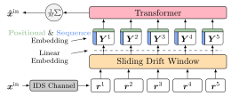

<p align="center">
    
</p>

# BCJRFormer
Codebase for my master thesis on **Transformer-Based Decoding in Concatenated Coding Schemes Under Synchronization Errors**. 

We investigate the usage of transformer-based decoders to address problems with transmissions via an insertion, deletion, and substitution (IDS) channel in the context of DNA data storage. 

**Contributions:**
- *BCJRFormer*: A transformer for coded [Multiple sequence alignment](https://en.wikipedia.org/wiki/Multiple_sequence_alignment). Performance scales similar to the BCJR algorithm, but the model can be used for larger cluster sizes due to quadratic complexity (compared to BCJR's exponential complexity) in the number of codeword transmissions.
- *ConvBCJRFormer*: A cross-attending transformer to decode convolutional codes. Initial step towards including linear outer code information within the synchronization process, which is for more general linear codes infeasible within BCJR. Our model yields slightly higher error rates compared to BCJR.
- *ECCT for Outer Decoding*: We provide an implementation of a dynamic dataset which uses ECCT as an outer decoder on top of BCJR or a pretained *BCJRFormer* model. By combining inner and outer transformer-based decoders, we show that lower error rates can be achieved compared to combinations involving BCJR or Believe Propagation.  


Both BCJR and Believe Propagation are implemented with [numba](https://github.com/numba/numba) compilation, permitting parallelizable joint decoding of nonbinary marker/convolutional codes with up to $M=4$ transmissions. 

**Disclaimer:** This codebase was somewhat hastily refactored - Some variable names might still be misleading (especially in the context of the thesis).

# Setup
To install the project, you need to have [Poetry](https://python-poetry.org/) installed. At least Python 3.11 is required. Once you have Poetry, you can install all the dependencies by running the following command:

```sh
poetry install
```

If you have multiple Python versions you can specify the Python version to use with:
```sh
poetry env use python3.x
```
Scripts can then be run via `poetry run python foo.py`. If you have specific CUDA requirements, you'll have to recreate the poetry environment by adjusting the `pyproject.toml` file.


# Running code
### Training
Training is dispatched via the `main.py` script. For a quick overview on all possible commands, call:
```sh
poetry run python main.py --help
```

We use [Spock](https://github.com/fidelity/spock) for config management (sorry!). Sometimes CLI commands can be a bit unintuitive. In general, use: 
```sh
poetry run python main.py -c model_config.yaml code_config.yaml --ModelConfig.foo bar
```  
to load model and code config, then you can overwrite key-value pairs (in this case the model_config's key `foo` with value `bar`).

### Evaluation
Write/Use an evaluate config and use the script `evaluate.py`, e. g.:
```sh
poetry run python eval.py -c evaluate_config.yaml code_config.yaml
```

### Optional: Weights & Biases (wandb) Logging
We track experiments using Weights & Biases (wandb). Wandb support can be enabled via the configuration file.

# Project Structure

<pre>
.
├── bcjrformer/                         :   Project folder
│   ├── <b>bcjr/</b>                           :   <b>CLI for BCJR</b> & BP (with parallelization support)
│   │   ├── cc_bcjr_ids_ldpc.py         :   Convolutional Code BCJR 
│   │   └── marker_bcjr_ids_ldpc.py     :   Marker Code BCJR 
│   ├── code_db/                        :   Linear Code (.alist) database
│   ├── codes/                      
│   │   ├── convolutional_code.py       :   Implementation of BCJR & general conv. codes
│   │   ├── galois_field.py             :   Numba-compatible finite field utils (adjusted from Galois library)
│   │   ├── linear_code.py              :   Linear Codes & Implementation of Believe Propagation
│   │   ├── marker_code.py              :   Marker Codes
│   │   └── ...
│   ├── configs/                        :   Definition of Spock-configs
│   │   └── ...
│   ├── datasets/                       :   Dynamic datasets for inner / outer codeword generation
│   ├── models/
│   │   ├── <b>bcjrformer.py</b>               :   <b>Proposed inner decoder for (nonbinary) marker codes</b>
│   │   ├── <b>convbcjrformer.py</b>           :   <b>Proposed inner decoder for convolutional codes </b>
│   │   ├── ids_ecct_outer_model.py     :   ECCT model of https://github.com/yoniLc
│   │   └── ...
│   └── trainers/                       :   "Trainer" classes (but they also perform evaluation)
│
├── configs/                            :   Some pre-crafted .yaml configs for training
├── notebooks/                          :   Notebooks to evaluate models / generate figures
├── thesis/                             :   All Figures / Numbers / Latex of my master thesis
├── eval_scripts/                       :   Scripts to evaluate models
├── ...
├── eval.py                               :   Evaluation only of trained models   
└── <b>main.py/</b>                            :   <b>Main Training Script</b>
</pre>


